# Target Lambda–SQS–S3–Neon Execution Flow

## Status and document role

Current execution-flow reference, reconciled on **11 August 2026**.

This document is the concise flow representation. Architectural ownership and
prohibited deviations live in `AWS_ASYNC_DEPLOYMENT_DIRECTION.md`. Payload,
migration, verification, and cutover requirements live in
`PRELIMINARY_LAMBDA_SQS_S3_MIGRATION_PLAN.md`. The final implementation
checklist has been authored as
`FINAL_LAMBDA_SQS_S3_MIGRATION_EXECUTION_PLAN.md` under
the root authoring standards after the required payload-discovery probes
completed. Section 10A contains the G-R7-through-G-R9 corrective specification;
`ACTIVE_EXECUTION_STATE.md`, not this flow document, is the sole execution
authority.

## Flow diagram

```mermaid
flowchart TD
    RUN["Existing frontend/API<br/>run + owner + category input"] --> QP["Current query generation/probing,<br/>editable review and explicit confirmation;<br/>durable validation probe reuse"]
    QP --> DREG["Neon: register immutable discovery stage<br/>generation + manifest + expected queryIds"]
    DREG --> DQ["Discovery SQS<br/>one logical message per confirmed RunQuery.id"]

    DQ --> DW["Store-discovery Lambda<br/>one runId + generation + queryId"]
    DW --> DART[("S3 per-query terminal artifact<br/>runs/runId/queries/queryId/domains.json")]
    DART --> DTERM["Neon: idempotent terminal query task<br/>artifact key + fingerprint"]
    DTERM --> DCHECK["SQS discovery aggregation-check"]
    DREG -. "expectedCount = 0 also emits check" .-> DCHECK
    DCHECK --> DGATE{"Neon terminalCount<br/>equals expectedCount?"}
    DGATE -->|No| DEXIT["Check exits;<br/>a later terminal task sends another check"]
    DGATE -->|Yes| DCLAIM["Domain aggregator conditionally claims<br/>collecting -> aggregating lease"]

    DCLAIM --> DVERIFY["Validate every expected query task,<br/>terminal state and artifact fingerprint"]
    DVERIFY --> DEDUPE["Merge and deduplicate domains<br/>using current stable shop identity;<br/>retain all query/category provenance"]
    DEDUPE --> REUSE["Neon bounded reuse read<br/>strict identity + contract + scope + metric<br/>+ freshness checks; not row existence"]
    REUSE --> FLAGS["Per-domain immutable work plan<br/>needsLead<br/>needsTraffic<br/>needsCruxRest<br/>needsCruxBigQuery<br/>needsCrux = REST OR BigQuery"]
    FLAGS --> MANIFEST[("S3 cumulative domain manifest<br/>runs/runId/domains-manifest.json")]

    MANIFEST --> LREG["Neon: bulk checkpoint Shop/RunStore;<br/>register immutable lead stage"]
    LREG --> LQ["Lead SQS<br/>only needsLead=true domains;<br/>initial Lambda maximum concurrency 2"]
    LREG -. "zero tasks/all reusable emits check" .-> LCHECK["SQS lead aggregation-check"]

    LQ --> LW["Lead-enrichment Lambda<br/>one stable domain"]
    LW --> PAGES["Rank at most 5 same-store pages;<br/>ordinary HTTP first"]
    PAGES --> RENDER{"Any failed or unusable<br/>ordinary responses?"}
    RENDER -->|No| LEAD["Extract and validate contact evidence"]
    RENDER -->|Yes| BL["One logical Browserless domain batch<br/>one active session; tokens sequential<br/>45s total session ceiling; stop early"]
    BL --> LEAD
    LEAD --> LART[("S3 per-domain terminal lead artifact<br/>runs/runId/domains/domainId/lead.json<br/>success, rejected or safe failed")]
    LART --> LTERM["Neon: idempotent terminal lead task<br/>artifact key + fingerprint"]
    LTERM --> LCHECK
    LCHECK --> LGATE{"Neon terminalCount<br/>equals expectedCount?"}
    LGATE -->|No| LEXIT["Check exits;<br/>a later terminal task sends another check"]
    LGATE -->|Yes| LCLAIM["Lead aggregator conditionally claims<br/>collecting -> aggregating lease"]
    LCLAIM --> LVERIFY["Verify new + reusable + rejected + failed<br/>lead outcomes and identities"]
    LVERIFY --> LBULK["Bulk-persist private run Lead/RunStore<br/>and diagnostics; no new profile/grant visibility"]
    LBULK --> LDB[("Neon private lead checkpoint<br/>resultsAvailable=false")]

    LDB --> TREG["Derive qualified eligible domains;<br/>register immutable traffic_crux stage"]
    TREG --> TQ["Traffic + CrUX SQS<br/>one logical task per domain needing any source"]
    TREG -. "zero tasks/all reused emits check" .-> TCHECK["SQS final aggregation-check"]

    TQ --> TBATCH["Combined traffic/CrUX Lambda trigger<br/>one Neon-fenced stage-wide owner<br/>loads immutable run work set"]
    LDB -. "persisted qualified leads" .-> TBATCH
    TBATCH --> DFS["DataForSEO missing scopes<br/>run-wide bulk targets/tasks<br/>durable per-scope batch artifacts"]
    TBATCH --> CR["CrUX REST missing origins<br/>bounded per-origin calls"]
    TBATCH --> BQ["CrUX BigQuery missing origins<br/>one run-wide table lookup + bounded query<br/>durable batch artifact + byte guards"]
    DFS --> TCOMBINE["Independent terminal components<br/>available / partial / no_coverage / unavailable<br/>ambiguous / contract_mismatch / reused / skipped"]
    CR --> TCOMBINE
    BQ --> TCOMBINE
    TCOMBINE --> TART[("One S3 combined artifact per logical domain<br/>runs/runId/domains/domainId/traffic-crux.json")]
    TART --> TTERM["Neon: idempotent terminal traffic_crux task<br/>artifact key + fingerprint"]
    TTERM --> TCHECK
    TCHECK --> TGATE{"Neon terminalCount<br/>equals expectedCount?"}
    TGATE -->|No| TEXIT["Check exits;<br/>a later terminal task sends another check"]
    TGATE -->|Yes| TCLAIM["Final aggregator conditionally claims<br/>collecting -> aggregating lease"]
    TCLAIM --> TVERIFY["Verify every required, reused, skipped and<br/>failed source component and artifact"]
    TVERIFY --> TBULK["Bulk-persist profiles/grants and DataForSEO,<br/>CrUX REST/BigQuery rows; finalize score v3"]
    TBULK --> FINAL[("Neon atomic final publication<br/>summary + completed + resultsAvailable=true")]
    FINAL --> DONE["Existing owner-scoped history, results,<br/>master leads, traffic, CSV and frontend flow"]
```



## Coordinator rule used by every stage

The diagram's aggregation gates use the same durable protocol:

1. Register the immutable expected item set in Neon before dispatch.
2. Claim a task with a bounded lease and fencing token.
3. Perform only the work declared by the immutable manifest.
4. Write the versioned S3 artifact before terminal coordination.
5. Record the terminal task idempotently with its artifact fingerprint.
6. Increment stage counters only on the first nonterminal-to-terminal change.
7. Send an aggregation-check before acknowledging the worker message.
8. An early aggregation-check exits without polling when the stage is not ready.
9. When counts match, one aggregator conditionally claims the stage and verifies
   every expected item; counts alone are insufficient.
10. Publication and next-stage registration are replay-safe and fenced.
11. `expectedCount = 0` emits a check so empty and all-reused stages advance.

SQS queue emptiness, S3 object count, and S3 creation events never prove stage
completion.

## Detailed text flow

### Existing control plane and discovery

1. A user starts a run through the existing authenticated category-input flow.
2. The current backend generates, probes, validates, exposes for review, and
   receives explicit confirmation of the complete query revision.
   AWS confirmation validation reuses each accepted durable query probe. A
   changed/missing probe is protected by immutable attempt/result artifacts;
   discovery workers consume the confirmed probe results and make zero Google
   or Browserless requests.
3. Scraping does not begin until the confirmed revision still matches the
   editable revision.
4. Neon registers one immutable discovery stage containing every expected
   durable `RunQuery.id` for the run generation.
5. One logical discovery message is sent per confirmed query. Messages contain
   identity, generation, fingerprints, and artifact references—not large
   provider payloads.
6. Each discovery Lambda processes exactly one query and produces an explicit
   success, empty, partial, or safe-failed terminal artifact.
7. The worker writes
   `runs/{runId}/queries/{queryId}/domains.json`, records the Neon terminal task,
   sends an aggregation-check, and then acknowledges the original SQS message.
8. Duplicate delivery reconciles the same task and fingerprint rather than
   repeating completed work or overwriting a conflicting artifact.

### Domain aggregation and immutable work planning

9. The domain aggregator runs only after the Neon discovery gate is complete and
   it obtains the single aggregation lease.
10. It validates every expected query task and artifact, then merges candidates
    with the existing `Shop.stableKey` and `shopIdForStableKey()` identity rules.
11. It retains every query ID, category intent, occurrence, representative
    selection, diagnostic, and identity fact required by the historical lead
    snapshot.
12. It performs bounded source-specific Neon reuse reads. Reuse requires strict
    identity, contract, scope, metric-set, freshness, and normalized-payload
    compatibility; row existence alone is insufficient.
13. Every domain receives an immutable work plan with `needsLead`,
    `needsTraffic`, `needsCruxRest`, `needsCruxBigQuery`, and logical-OR
    `needsCrux`.
14. The aggregator writes `runs/{runId}/domains-manifest.json`, bulk-checkpoints
    the required `Shop`/`RunStore` state, registers the immutable lead task set,
    and dispatches only `needsLead=true` domains.

### Lead enrichment and checkpoint

15. One lead message represents one stable domain. Initial lead Lambda maximum
    concurrency is two because any lead task may require Browserless.
16. The worker discovers and ranks at most five verified same-store evidence
    pages from the homepage, initial page links, and bounded sitemap discovery.
17. It attempts ordinary HTTP first and sends only failed or unusable pages into
    one logical Browserless domain render batch.
18. Browserless uses `/function` with no more than one active session for the
    domain, tries primary and fallback tokens sequentially without overlap, enforces a
    45-second total session ceiling with shorter page deadlines, and stops once
    sufficient contact evidence exists.
    Immutable per-domain Browserless and optional AI-normalization attempt
    artifacts prevent a process restart from repeating either paid call.
19. The terminal lead artifact records qualified, rejected, or safe-failed state,
    contact/profile evidence, identity, and privacy-safe page/render diagnostics.
    It excludes raw HTML, provider bodies, credentials, and credential-bearing
    URLs.
20. The lead worker writes `runs/{runId}/domains/{domainId}/lead.json`, records
    the Neon terminal task, and sends a lead aggregation-check.
21. Once complete, one lead aggregator validates all new, reusable, rejected,
    and failed outcomes and bulk-publishes only private run-specific
    `RunStore`/`Lead` rows and diagnostics. New global profiles and owner grants
    remain unlinked until final publication; `resultsAvailable` stays false.
22. This private lead checkpoint is durable even if later traffic work fails,
    but it is not a public partial result.

### Traffic, both CrUX sources, and completion

23. Traffic eligibility is derived from the persisted qualified lead set.
24. Neon registers one logical `traffic_crux` task for each eligible domain that
    needs at least one source. All-reused and no-eligible runs advance through an
    explicit zero-count check.
25. A traffic Lambda invocation may receive any subset of per-domain trigger
    messages. It must first acquire the one Neon-fenced traffic execution lease
    for that run/generation, then load the complete immutable work plan and
    registered task set. A non-owner performs no provider call. SQS batch
    boundaries never define provider batches.
    Each claimed global provider/scope row is fenced by its durable PipelineTask
    ID, so releasing the stage-wide Run lease before final aggregation cannot
    let another local or AWS run steal that work.
26. It executes only missing source components while preserving source-specific
    reuse:

    - DataForSEO retains bulk targets and configured scopes;
    - CrUX REST retains bounded one-origin requests for score-v3 Core Web Vitals;
    - CrUX BigQuery retains one latest-table lookup and bounded multi-origin
      popularity/device query with dry-run and maximum-bytes-billed guards.

27. The stage-wide owner must not turn DataForSEO or BigQuery into one
    paid/large query per domain. For the verified 52-domain baseline, one
    successful no-reuse execution remains 10 DataForSEO scope tasks, at most 52
    CrUX REST calls, one BigQuery table-list call, one dry run, and one bounded
    BigQuery query. A normalized per-scope DataForSEO batch artifact and one
    normalized BigQuery batch artifact are written immutably before per-domain
    source artifacts are derived, so a retry can finish fan-out without
    repeating a durably recorded provider result. A response lost before its
    first durable artifact retains the provider-specific ambiguous/retry rule.
    CrUX REST and live BigQuery use immutable attempt artifacts; the BigQuery
    artifact retains accepted dry-run month/bytes and the stable request ID.
28. Each logical domain receives its own combined artifact with independent
    `dataforseo`, `cruxRest`, and `cruxBigQuery` terminal components. Each
    component explicitly records required, reused, skipped, available,
    partial, no-coverage, unavailable, ambiguous, or contract-mismatch state as
    supported. DataForSEO `partial` is material and references its validated
    source artifact.
29. After writing each
    `runs/{runId}/domains/{domainId}/traffic-crux.json`, the worker records that
    domain's terminal task. Partial SQS batch responses prevent successful
    siblings from being retried.
30. The final aggregator obtains the single stage lease only after all expected
    tasks are terminal, then validates every component and artifact.
31. It creates/links new profiles, settles task-owned global work, creates owner
    grants, bulk-publishes DataForSEO, CrUX REST, and CrUX BigQuery cache and
    run-specific rows, finalizes score v3 and summaries, and atomically sets the
    run to completed with `resultsAvailable=true`.
32. Existing owner-scoped history, current master leads, results, traffic,
    serializers, CSV, and frontend behavior remain unchanged.

## Terminal outcome requirements

Missing artifacts do not represent business outcomes. Every expected logical
task is terminal as one of:

```text
succeeded
skipped
failed
cancelled
```

Provider components preserve the finer current meanings where supported:

```text
available
no_coverage
unavailable
ambiguous
contract_mismatch
reused
skipped
```

A provider terminal failure may yield a valid partial/unavailable enrichment
without deleting the lead checkpoint. Infrastructure, invariant, ownership, or
artifact-reconciliation failures remain run failures.

## Required invariants

- Neon is the sole durable coordinator and application database.
- S3 holds artifacts; SQS supplies at-least-once delivery and backpressure.
- No Fargate, Step Functions, DynamoDB, queue-emptiness fan-in, or S3-event fan-in
  is introduced into this execution path.
- Every stage uses immutable expected work, idempotent terminal records, bounded
  leases, fencing, deterministic artifacts, and a single aggregator claim.
- Existing identity, ownership, query revision, history, grants, scoring, public
  serializer, and frontend contracts remain authoritative.
- Both CrUX REST and CrUX BigQuery remain independently required, reusable,
  terminal, persisted, and observable.
- Browserless remains HTTP-first fallback work using one sequential `/function`
  session per domain, maximum account concurrency two, and a 45-second session
  ceiling.
- DataForSEO and BigQuery retain batch economics.
- Results become visible only through the atomic final Neon publication.
